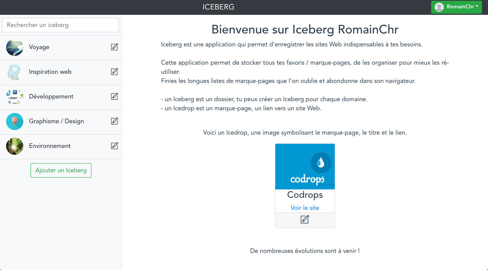
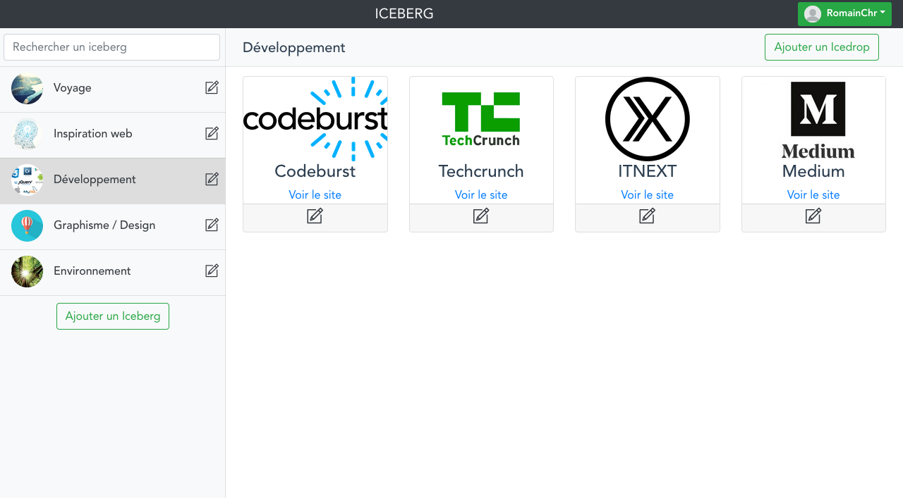
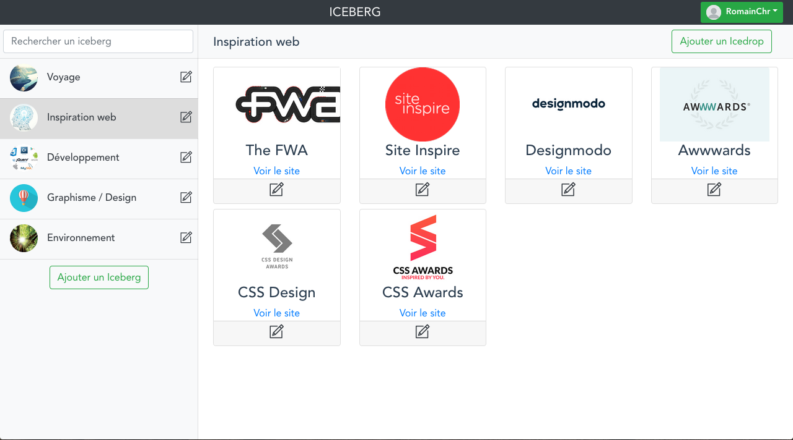

# Iceberg

## Introduction

Iceberg is a bookmark application. You can create icebergs (categories) to sort your bookmarks.

### Iceberg link

- Username : RomainChr
- Password : RomainChr
- http://iceberg.romainchery.fr

## Screenshots

## Technologies - MEVN Stack

### Front

* Webpack
* VueJS - Vue Router
* Bootstrap

### Back

* Node
* Express
* Passport.js (Token Authentication)
* MongoDB

# Installation

Simply clone this repo :
git clone

npm install

Start MongoDB : 
mongod

### Dev : 
http://localhost:8080

Front :
- npm run dev

Back :
- npm run dev_server

### Production : 
http://localhost:3000
- npm start
